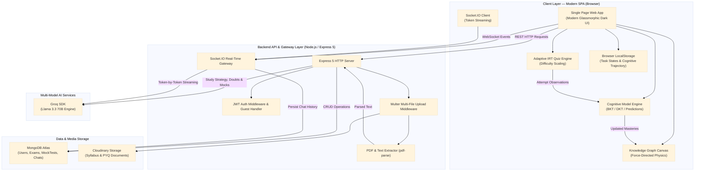

# PrepOS — AI-Powered Personalized Learning Intelligence System (Adaptive Education Engine)

[](https://nodejs.org/)
[](https://expressjs.com/)
[](https://socket.io/)
[](https://www.mongodb.com/atlas)
[](https://groq.com/)
[](LICENSE)

> **PrepOS** is an intelligent, multi-model adaptive education engine built to diagnose conceptual knowledge gaps, trace learning sequences, model concept dependencies, and dynamically generate personalized study roadmaps and assessments for Indian engineering exams (JEE, GATE, University Finals, Placements).

- **Author:** [Anurag Gupta](https://github.com/anuraggupta07122006)
- **Live Demo / Cloud Service:** [https://prep-os-live.onrender.com](https://prep-os-live.onrender.com)
- **Architecture:** Cognitive Modeling + Deep Knowledge Tracing (DKT) + Graph AI + GenAI + Socket.IO Streaming

---

## 🧠 The Core Problem Addressed

Indian students preparing for high-stakes examinations frequently:
- **Rely on rote memorization** rather than deep conceptual understanding.
- **Fail to identify foundational knowledge gaps** (e.g., struggling with Banker's Algorithm because prerequisite Semaphores/Mutexes are unmastered).
- **Study blindly** through static question banks without adaptive difficulty scaling.

Most EdTech platforms are merely static content repositories. **PrepOS** is a cognitive intelligence engine that models student learning states mathematically and adapts continuously.

---

## 🚀 Key Learning Intelligence Capabilities

```
┌────────────────────────────────────────────────────────────────────────┐
│               PrepOS Learning Intelligence Pipeline                    │
├───────────────────┬───────────────────┬────────────────────────────────┤
│ 1. Bayesian & DKT │ 2. Knowledge      │ 3. Adaptive IRT                │
│    Knowledge      │    Graph          │    Assessments                 │
│    Tracing        │    Prerequisites  │    & Diagnostics               │
├───────────────────┼───────────────────┼────────────────────────────────┤
│ 4. Milestone Tree │ 5. WebSocket      │ 6. Multi-File                  │
│    Roadmap        │    Real-Time AI   │    Ingestion                   │
│    Flowchart      │    Token Stream   │    (PDF/PYQ/Notes)             │
└───────────────────┴───────────────────┴────────────────────────────────┘
```

1. **Concept Mastery Score (BKT / DKT Cognitive Modeling)**
   - Computes Bayesian Knowledge Tracing posterior probabilities $P(L_t \mid \text{observation})$ across concept clusters.
   - Models slip $P(S)$, guess $P(G)$, and transition $P(T)$ probabilities dynamically upon each question attempt.
2. **Interactive Prerequisite Knowledge Graph**
   - Canvas-based, force-directed graph modeling foundational and advanced concepts.
   - Dynamic mastery tier colors: 🟢 Mastered (&gt;75%), 🟡 Learning (45–75%), and 🔴 Critical Prerequisite Gap (&lt;45%).
   - Glowing halo alert badges for prerequisite breaches with an interactive node inspector drawer.
3. **Adaptive IRT Assessment Engine**
   - Item Response Theory (IRT) difficulty scaling (`easy`, `medium`, `hard`).
   - Dynamic feedback loop updating the student's cognitive state in real time.
4. **Interactive Milestone Study Roadmap**
   - Milestone flowchart tree with day-by-day task breakdown, time estimations, and local persistence.
5. **Real-Time Streaming AI Study Room**
   - Authenticated WebSocket streaming via Socket.IO yielding token-by-token Groq Llama 3.3 responses with syntax highlighting and markdown parsing.
6. **Academic Doubt Solver**
   - Structured mathematical and algorithm edge-case derivations.

---

## 📐 System Architecture



---

## 🔌 REST API & WebSocket Reference

### User Authentication (`/api/v1/users`)
| Method | Endpoint | Auth | Description |
| :--- | :--- | :--- | :--- |
| `POST` | `/register` | Public | Register new student account |
| `POST` | `/login` | Public | Authenticate user & issue JWT tokens |
| `POST` | `/guest-login` | Public | Instant zero-setup guest login |
| `GET` | `/me` | Bearer JWT | Fetch current authenticated profile |
| `POST` | `/logout` | Bearer JWT | Invalidate tokens and clear session |
| `POST` | `/refresh-token` | Public | Refresh expired access token |

### Exam & Intelligence Services (`/api/v1/exams`)
| Method | Endpoint | Auth | Description |
| :--- | :--- | :--- | :--- |
| `POST` | `/setup` | Bearer JWT | Ingest syllabus, PYQs, and generate study roadmap |
| `GET` | `/list` | Bearer JWT | Retrieve all configured exams for active user |
| `GET` | `/strategy/:examId` | Bearer JWT | Fetch milestone flowchart strategy JSON |
| `POST` | `/doubt/:examId` | Bearer JWT | Resolve conceptual doubt with step-by-step math |
| `GET` | `/mock/:examId` | Bearer JWT | Generate or retrieve adaptive assessment questions |
| `POST` | `/mock/:examId/submit`| Bearer JWT | Submit score and save assessment performance |
| `GET` | `/chat/:examId` | Bearer JWT | Fetch historical AI tutoring chat messages |

### Real-Time WebSockets (`Socket.IO`)
| Event | Direction | Payload | Description |
| :--- | :--- | :--- | :--- |
| `join-exam` | Client → Server | `examId` | Joins private room for exam context |
| `send-message` | Client → Server | `{ examId, message }` | Sends student prompt to AI tutor |
| `chat-stream-start` | Server → Client | None | Signals start of streaming response |
| `chat-stream-chunk` | Server → Client | `chunk` (string) | Yields token chunk from Groq model |
| `chat-stream-end` | Server → Client | None | Signals completion of streaming response |

---

## 🛠️ Repository Directory Structure

```
Adaptive-Learning-Engine/
├── .env.example                          # Environment variable configuration template
├── package.json                          # NPM dependencies and run scripts
├── package-lock.json                     # Dependency lockfile
├── index.js                              # HTTP & Socket.IO server entrypoint
├── app.js                                # Express 5 configuration & middleware
├── render.yaml                           # Cloud deployment manifest
├── Readme.md                             # Comprehensive project documentation
├── server/                               # Backend Application
│   ├── public/temp/                      # Local temporary upload storage
│   └── src/
│       ├── controllers/
│       │   ├── exam.controller.js        # Strategy, Doubt, Mock & Ingestion logic
│       │   └── user.controller.js        # Auth, JWT, and Guest session logic
│       ├── db/index.js                   # MongoDB Atlas connection helper
│       ├── middlewares/
│       │   ├── auth.middleware.js        # JWT verification middleware
│       │   └── multer.middleware.js      # File attachment middleware
│       ├── models/
│       │   ├── user.model.js             # User account schema
│       │   ├── exam.model.js             # Exam configuration & strategy schema
│       │   ├── mocktest.model.js         # Adaptive assessment schema
│       │   └── chat.model.js             # Chat history schema
│       ├── routes/
│       │   ├── exam.routes.js            # Exam REST endpoints
│       │   └── user.routes.js            # User auth REST endpoints
│       ├── utils/
│       │   ├── gemini.js                 # Groq Llama 3.3 SDK helper
│       │   ├── cloudinary.js             # Media storage helper
│       │   ├── ApiError.js               # Standardized error helper
│       │   └── ApiResponse.js            # Standardized JSON response helper
│       └── socket.js                     # Real-time WebSocket token streaming handler
├── client/                               # Frontend Application
│   ├── index.html                        # SPA shell with all 6 intelligence modules
│   ├── style.css                         # Modern dark design system & responsive grid
│   ├── script.js                         # Master UI orchestrator & state manager
│   ├── server.js                         # Standalone frontend preview development server
│   └── js/
│       ├── api.js                        # Unified API gateway & Socket.IO client
│       ├── cognitive-model.js            # BKT / DKT cognitive modeling & predictions
│       ├── knowledge-graph.js            # Force-directed Canvas concept graph engine
│       └── adaptive-quiz.js              # Adaptive IRT testing & diagnostic engine
└── testing_materials/                    # Real course files for immediate 1-click testing
    ├── syllabus.txt                      # Operating Systems syllabus
    ├── pyq_2025.txt                      # Previous year examination questions
    └── notes.txt                         # High-yield revision formulas & definitions
```

---

## ⚡ Quickstart & Local Setup

### 1. Clone the Repository
```bash
git clone https://github.com/anuraggupta07122006/Adaptive-Learning-Engine.git
cd Adaptive-Learning-Engine
npm install
```

### 2. Option A: Instant Frontend Preview (Zero Database Setup)
```bash
npm run client
```
Open **[http://localhost:5000](http://localhost:5000)** in your browser. Click **"Continue as Guest"** and **"Load Sample Exam"** to immediately test the Knowledge Graph, DKT analytics, Adaptive Quiz, and AI Tutor.

### 3. Option B: Full-Stack Production Mode
Create a `.env` file in the root directory (based on `.env.example`):
```env
PORT=3000
MONGODB_URI=mongodb+srv://<username>:<password>@cluster.mongodb.net/exam_prep
GROQ_API_KEY=your_groq_api_key
CLOUDINARY_API_KEY=your_cloudinary_api_key
CLOUDINARY_API_SECRET=your_cloudinary_api_secret
CLOUDINARY_KEY_NAME=your_cloudinary_cloud_name
ACCESS_TOKEN_SECRET=your_jwt_access_secret
ACCESS_TOKEN_EXPIRY=1d
REFRESH_TOKEN_SECRET=your_jwt_refresh_secret
REFRESH_TOKEN_EXPIRY=10d
CORS_ORIGIN=*
```

Start the server:
```bash
npm start
```
Open **[http://localhost:3000](http://localhost:3000)** in your browser.

---

## 🔬 Research & Academic Alignment

This system is engineered to serve as a research-grade foundation for studies on:
- **Transformer & Bayesian Knowledge Tracing (BKT/DKT)** for Indian Competitive Exam Systems.
- **Concept Dependency Graph Learning**: Modeling prerequisite dependency violations in student assessment trajectories.
- **Explainable Student Performance Modeling**: Estimating learning retention and exam readiness using dynamic Item Response Theory (IRT).

---

## 👤 Author

**Anurag Gupta**  
- GitHub: [@anuraggupta07122006](https://github.com/anuraggupta07122006)  
- Email: ag257725941@gmail.com  
